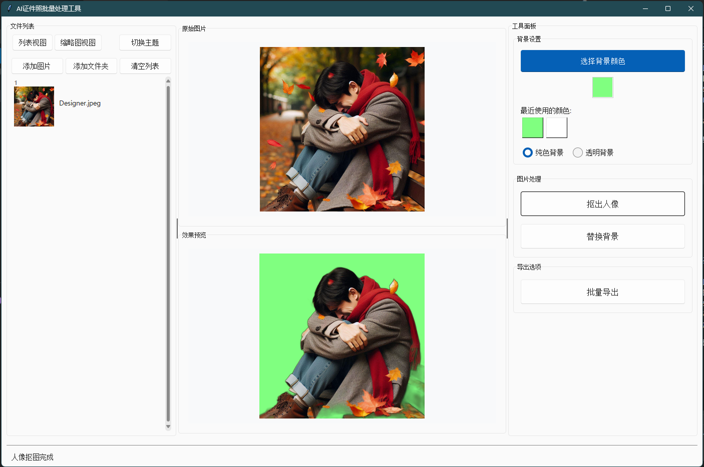

# AI证件照批量换背景工具

本项目是一个基于AI的人像抠图与证件照批量换背景桌面应用，支持拖拽、批量处理、背景替换、导出等功能，界面美观，操作简单，适合零基础用户。

---

## 目录
- [功能介绍](#功能介绍)
- [环境要求](#环境要求)
- [安装与部署](#安装与部署)
- [使用说明](#使用说明)
- [常见问题](#常见问题)
- [致谢](#致谢)

---

## 功能介绍
- 支持批量导入图片（拖拽/选择文件）
- AI自动抠出人像，支持透明/纯色背景
- 一键批量替换背景色
- 支持批量导出处理后的图片
- 现代化美观UI，操作简单

### 示例界面



---

## 环境要求
- Windows 10/11（推荐）
- Python 3.8 及以上
- 建议使用 Anaconda/Miniconda 或官方 Python

---

## 安装与部署

### 1. 安装 Python
- [官网下载 Python](https://www.python.org/downloads/)
- 安装时务必勾选“Add Python to PATH”

### 2. 下载项目源码
- 直接下载本项目压缩包并解压，或使用 git：
  ```bash
  git clone <本项目地址>
  ```

### 3. 安装依赖
- 打开命令行（Win+R 输入 `cmd` 回车），进入项目文件夹：
  ```bash
  cd 路径\图片换背景
  ```
- 一键安装依赖：
  ```bash
  pip install -r requirements.txt
  ```
  > 若提示权限不足，可加 `--user` 参数。

### 4. 运行程序
- 命令行输入：
  ```bash
  python repicbg.py
  ```
- 首次运行会自动下载AI模型和图标，需联网。

---

## 使用说明

1. **添加图片**：点击左侧“添加图片”按钮，或直接拖拽图片到左侧列表。
2. **切换视图**：可在列表/缩略图模式间切换。
3. **选择图片**：点击图片名称或缩略图，右侧显示预览。
4. **设置背景**：右侧可选择“纯色背景”或“透明背景”，如选纯色可自定义颜色。
5. **抠出人像**：点击“抠出人像”按钮，预览区显示抠图结果。
6. **批量替换背景**：点击“替换背景”，选择输出文件夹，自动批量处理所有图片。
7. **批量导出**：如需仅导出原图，点击“批量导出”。
8. **进度与状态**：底部进度条和状态栏实时显示处理进度。

---

## 常见问题

- **Q: 启动报错“缺少依赖”？**
  - A: 请按提示运行 `pip install -r requirements.txt`。
- **Q: 界面无响应/闪退？**
  - A: 请确保 Python 版本为 3.8 及以上，且依赖安装完整。
- **Q: 模型下载失败？**
  - A: 检查网络，或手动下载模型文件放到提示路径。
- **Q: 图标不显示？**
  - A: 首次运行需联网自动下载图标，或自行放置到 `icons/` 文件夹。

---

## 致谢
- [rembg](https://github.com/danielgatis/rembg) AI抠图引擎
- [sv-ttk](https://github.com/rdbende/sv-ttk) 现代化Tk主题
- [flaticon](https://www.flaticon.com/) 图标资源

---

如有问题或建议，欢迎反馈！
